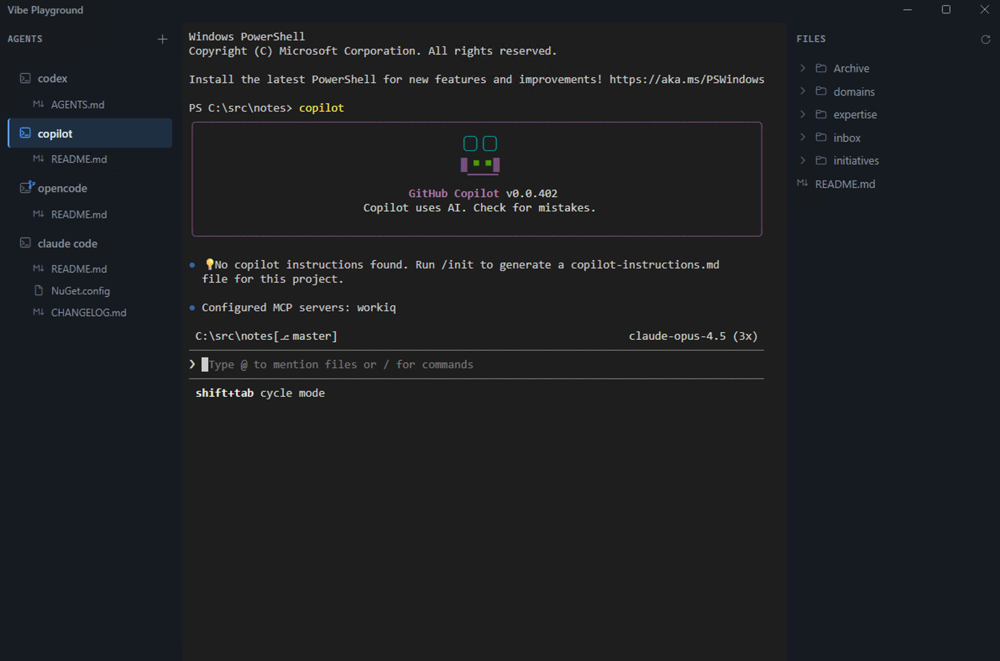
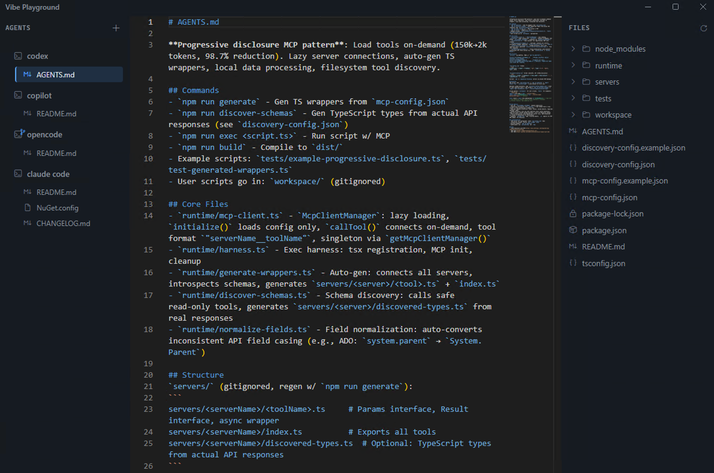
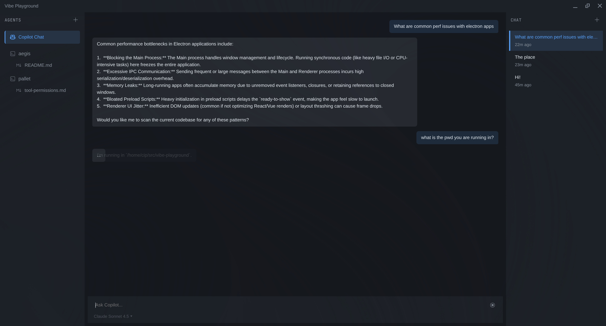

# Vibe Playground

A modern Electron-based agent manager for working across multiple repositories simultaneously. Features a three-pane layout with integrated file browsing and syntax-highlighted file viewing.



## Features

### 🖥️ Multi-Agent Management
- Open multiple agent sessions, each in a different directory/repository
- Full PTY support via node-pty - TUI apps like `vim`, `htop`, and GitHub Copilot CLI work perfectly
- Agent state preserved when switching between views
- Quick switching between agents via the left sidebar

### 📁 Integrated File Browser
- File tree view showing the current agent's working directory
- Expandable folders with lazy loading
- Click files to view them with syntax highlighting

### ✨ Monaco Editor Integration
- View files with full syntax highlighting powered by Monaco Editor (VS Code's editor)
- Support for TypeScript, JavaScript, JSON, Markdown, CSS, HTML, Python, YAML, and more
- Line numbers and minimap navigation



### 🎨 Three-Pane Layout
- **Left Pane**: Agent and file list - see all open agents and their associated files
- **Center Pane**: Active agent or file viewer
- **Right Pane**: File tree for the current agent's directory

### 🔄 Auto-Updates
- Automatic update checks on startup
- Background downloads with progress indicator
- Non-disruptive updates - install on next restart
- Toast notifications for update status



### 💬 Copilot Chat
- Integrated GitHub Copilot chat powered by `@github/copilot-sdk`
- Multiple conversations with automatic naming from first message
- Streamed responses displayed in real-time
- Conversations persisted to disk and restored on restart
- Manage conversations in the right pane — create, switch, rename, and delete
- Each conversation gets its own isolated AI context

## Installation

### Prerequisites
- Node.js 18+ 
- npm 9+
- GitHub CLI (`gh`) authenticated via `gh auth login` (required for Copilot Chat)

### Setup

```bash
# Clone the repository
git clone https://github.com/ipdelete/vibe-playground.git
cd vibe-playground

# Install dependencies
npm install

# Start the development server
npm start
```

## Usage

1. **Create an Agent**: Click the `+` button in the left pane and select a directory
2. **Run Commands**: Type in the terminal as you normally would - full shell support
3. **Browse Files**: Use the right pane to navigate the file tree
4. **Open Files**: Click any file to view it with syntax highlighting
5. **Switch Views**: Click agents or files in the left pane to switch between them
6. **Close Items**: Right-click on agents or files for context menu options
7. **Chat with Copilot**: Click "Copilot Chat" in the left pane to start a conversation
8. **Manage Conversations**: Use the right pane to create new conversations, switch between them, or right-click to rename/delete

### Keyboard Shortcuts
- `Ctrl+Tab` - Next agent
- `Ctrl+Shift+Tab` - Previous agent
- `Ctrl+Alt+\` - New agent
- `Ctrl+W` - Close current agent/file
- `F2` - Rename agent
- `Ctrl+?` - Show keyboard shortcuts help
- `Ctrl+Shift+I` - Open DevTools

## Tech Stack

- **Electron** - Cross-platform desktop app framework
- **React 19** - UI framework
- **TypeScript** - Type-safe development
- **xterm.js** - Terminal emulator
- **node-pty** - Pseudo-terminal for full shell support
- **Monaco Editor** - Code editor with syntax highlighting
- **@github/copilot-sdk** - GitHub Copilot chat integration
- **Electron Forge** - Build and packaging toolchain

## Project Structure

```
src/
├── index.ts                 # Main process entry
├── preload.ts              # Preload script (IPC bridge)
├── renderer.tsx            # Renderer entry
├── shared/
│   └── types.ts            # Shared TypeScript types
├── main/
│   ├── services/
│   │   ├── AgentService.ts     # PTY management
│   │   ├── CopilotService.ts   # Copilot SDK integration
│   │   ├── ConversationService.ts # Chat conversation persistence
│   │   └── FileService.ts      # File system operations
│   └── ipc/
│       ├── agent.ts        # Agent IPC handlers
│       ├── copilot.ts      # Copilot chat IPC handlers
│       ├── conversation.ts # Conversation CRUD IPC handlers
│       └── files.ts        # File IPC handlers
└── renderer/
    ├── App.tsx             # Main React component
    ├── contexts/
    │   └── AppStateContext.tsx  # State management
    ├── components/
    │   ├── Layout/         # Three-pane layout
    │   ├── LeftPane/       # Agent/file list
    │   ├── CenterPane/     # Agent & file viewer
    │   └── RightPane/      # File tree
    └── styles/
        └── global.css      # Application styles
```

## Development

```bash
# Run in development mode with hot reload
npm start

# Run tests
npm test

# Package the application
npm run package

# Create distributable
npm run make
```

## Known Limitations

- Agent resize may have slight delay during rapid window resizing
- Some complex TUI applications may have minor rendering differences compared to native terminals
- Copilot Chat requires `gh` CLI authentication — run `gh auth login` before using
- Restored chat conversations display previous messages but the AI does not retain context from prior sessions

## License

MIT

## Contributing

Contributions are welcome! Please feel free to submit a Pull Request.
